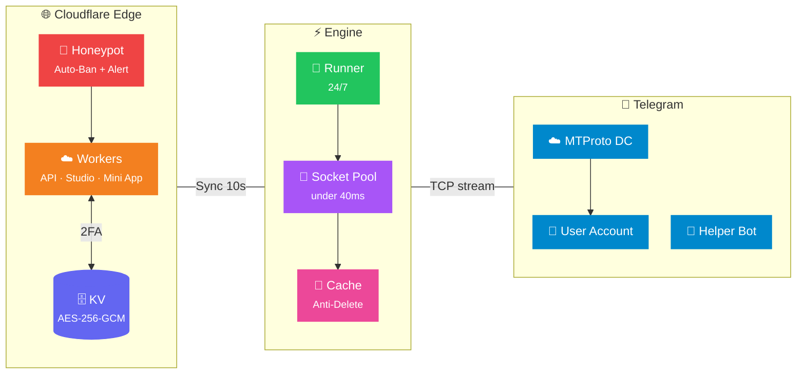

<div align="center">

[🇬🇧 English](README.en.md) &nbsp; | &nbsp; [🇮🇷 فارسی](README.md)

<br>


<br>

<h3>🔮 Next-Generation Intelligent Telegram Selfbot, Ghost Mode, 2FA Security & Cloud Studio</h3>
<h4><i>Next-Gen Telegram Profile Engine, 2FA Security, Ghost Mode, AI Smart Reply & Edge Logger Studio with Sub-40ms MTProto Precision</i></h4>

<br>

<a href="https://github.com/ArizoOwner/arizo-telegram-self-manager/actions"></a>
<a href="#"></a>
<a href="#"></a>
<a href="#"></a>
<a href="#"></a>

<br><br>

<a href="https://arizo-self.arizosupport.workers.dev/setup"></a>
<a href="https://arizo-self.arizosupport.workers.dev/"></a>

<br><br>

> [!TIP]
> **🚀 Online Interactive Setup Wizard:**  
> For easy, zero-command setup and automated configuration, launch the official **[Arizo Self Cloud Setup Wizard](https://arizo-self.arizosupport.workers.dev/setup)**:  
> **🔗 Direct Link: [https://arizo-self.arizosupport.workers.dev/setup](https://arizo-self.arizosupport.workers.dev/setup)** (also accessible at `/wizard`)

<br>

<p align="center">
  
</p>

<br>

<a href="https://workers.cloudflare.com/"></a>


<br><br>

</div>

---

<div align="center">

### 「 ✦ 18 Core Capabilities ✦ 」

</div>

<table>
<tr>
<td width="50%">

### ⏱️ &nbsp; 1. Sub-40ms Atomic Clock
> Minute-by-minute automatic time synchronization in account profile name with sub-100ms precision and warm socket pools.

- 🎯 Exact synchronization at second `00.000` without lagging behind
- 🎨 Over **32 designer typography presets** (Neon, Circled, Roman, Script, Math)
- 🕐 Full 12-hour (deluxe AM/PM) and 24-hour formats with custom prefixes/suffixes
- ⚡ Real-time updates without Telegram flood limits or account restrictions

</td>
<td width="50%">

### 📝 &nbsp; 2. Dynamic Live Bio
> Real-time dynamic updates in Telegram bio displaying calendar date, day of week, and time.

- 📅 Dynamic variables `{time}`, `{date}`, and `{day}` with Gregorian and Solar Jalali support
- 📐 Automatic string fitting strictly respecting Telegram's 70-character bio ceiling
- 🔄 Seamless cloud synchronization alongside clock updates
- 🎭 Pre-made quotes and custom template builder

</td>
</tr>
<tr>
<td width="50%">

### 💬 &nbsp; 3. Auto-Secretary (AFK Responder)
> 24/7 intelligent auto-responder for incoming private messages when away from keyboard.

- 💬 Fully customizable automated away message
- ⏰ Anti-spam cooldown timer from 1 minute to 24 hours per contact
- 🚫 Smart filtering to ignore Telegram service notifications and official bots
- 📋 Whitelist and blacklist exception rules for specific chats

</td>
<td width="50%">

### 🤖 &nbsp; 4. AI Smart Reply Assistant
> Intelligent contextual chat interactions and auto-replies powered by integrated LLM.

- 🧠 Deep content analysis of incoming messages with relevant contextual response generation
- 🎯 One-click enablement/disablement for target chats or contacts
- 🛡️ Loop prevention safety shields avoiding endless automated chatbot ping-pongs
- ⚡ Real-time serverless response delivery without requiring heavy external infrastructure

</td>
</tr>
<tr>
<td width="50%">

### 🗑️ &nbsp; 5. Anti-Delete Message Sniper
> Intercept, cache, and immediately forward deleted incoming private messages to your helper bot.

- 🔍 Ultra-lightweight in-memory cache on the runner with zero performance impact
- 👤 Extracts sender display name, username, numerical ID, and exact dispatch timestamp
- 📝 Recovers deleted texts, stickers, voice notes, photos, and media attachments
- 🛡️ Automatically filters out intentional deletions triggered by mute filters

</td>
<td width="50%">

### ✏️ &nbsp; 6. Anti-Edit Message Monitor
> Real-time monitoring of edited private messages, capturing both pre-edit and post-edit versions.

- ⚡ Direct diff extraction from raw Telegram MTProto protocol updates
- 🕒 Accurately records modification timestamps down to the second
- ⏮️ Visual comparison showing original text vs updated text with styled formatting
- 🔔 Instant notification dispatch to your private Telegram helper bot

</td>
</tr>
<tr>
<td width="50%">

### 🔥 &nbsp; 7. Anti-TTL View-Once Media Saver
> Intercept and permanently archive view-once self-destructing photos and videos before expiration.

- 🛡️ Automatically detects second-based TTL (Time-To-Live) flags on incoming private media
- 🖼️ Pristine extraction of photos, video clips, voice messages, and circular video notes
- 🚀 Direct delivery to your personal Telegram helper bot in original uncompressed quality
- 💾 Automatic fallback to Saved Messages if the helper bot is temporarily unreachable

</td>
<td width="50%">

### 👻 &nbsp; 8. Ghost & Stealth Mode
> Read messages silently without triggering blue checkmark read receipts (seen status).

- 👁️ Suppresses read receipt signals on incoming messages
- ⌨️ Convenient in-chat Telegram shortcuts: `.ghost on` and `.ghost off`
- 📖 In-chat `.read` command to quietly mark current chat as read without notifications
- 📚 In-chat `.read all` command to silently clear all unread badges across chats

</td>
</tr>
<tr>
<td width="50%">

### 🔇 &nbsp; 9. Silence & Auto-Purge Filter (Mute)
> Completely silence unwanted contacts and instantly purge messages for both parties.

- 🗑️ Two-way instant purge using MTProto `revoke: true` flag
- 🔢 Automatic support for both Persian and English digits
- ⌨️ Direct in-chat Telegram commands `.mute` and `.unmute`
- 👻 Automatic AccessHash resolution for users outside of your address book

</td>
<td width="50%">

### 🌙 &nbsp; 10. Night Sleep Schedule
> Automatically switches your profile to resting state during designated nighttime hours.

- 😴 Automatically changes last name to sleeping status (e.g. `😴 Sleep`)
- ⏰ Configurable night window (e.g. 23:00 to 07:00) with automatic morning recovery
- ⚡ Smartly suppresses AFK auto-replies and heavy routines during rest hours
- 🔋 Minimizes network and compute quota consumption

</td>
</tr>
<tr>
<td width="50%">

### 🔐 &nbsp; 11. Google 2FA (RFC 6238 TOTP)
> Highest enterprise security standard for dashboard authentication using Google Authenticator.

- 🔑 Strict RFC 6238 compliance with 30-second rotating 6-digit tokens
- 📱 Instant QR code generation with 32-character manual secret fallback
- 🆘 8 one-time emergency recovery codes for disaster account access
- 🛡️ Cryptographically signed session tokens across the studio dashboard

</td>
<td width="50%">

### 🍯 &nbsp; 12. Zero-Trust Honeypot Trap
> Active decoy traps automatically banning malicious scanners at the Cloudflare Edge.

- 🚨 Trapped decoy endpoints detecting vulnerability probes and unauthorized scans
- 🚫 Permanent automatic firewall bans for hostile IP addresses
- 📲 Instant security alerts delivered directly to the owner's Telegram helper bot
- 🛡️ True Zero-Trust architecture with zero latency overhead on authorized traffic

</td>
</tr>
<tr>
<td width="50%">

### 💾 &nbsp; 13. Military-Grade Encrypted Backup
> Full profile configuration backup and restore protected with AES-256-GCM.

- 📦 Exports all user preferences, Telegram session, lists, and templates into a single file
- 🔒 Encrypted with military-grade AES-256-GCM using your personal passphrase
- 🔄 Seamless one-click restoration with zero manual reconfiguration
- 🌐 Immune to data leaks even in the event of unauthorized storage access

</td>
<td width="50%">

### 🎨 &nbsp; 14. 32 Clock Typography Presets
> Comprehensive collection of digital typography styles with live interactive preview.

- 💎 Neon, Double-Stroke, Circled, Subscript, Superscript, Royal Serif, and Math styles
- 🔢 Native support for Classic Persian (`۱۲:۳۴`) and Latin (`12:34`) numerals
- 👁️ Real-time interactive preview on dynamic Telegram phone mockup
- ⚙️ Instant font switching without service restarts or re-logins

</td>
</tr>
<tr>
<td width="50%">

### 📱 &nbsp; 15. Telegram Mini App
> Complete selfbot management directly from inside Telegram without opening an external browser.

- ⚡ Native integration via inline WebApp button on your private helper bot
- 🌓 Automatic synchronization with your Telegram client's Dark/Light theme
- 📊 Real-time telemetry, active socket monitoring, and live audit logs
- 🛠️ Instant configuration updates via mobile-optimized neo-glass interface

</td>
<td width="50%">

### ⚡ &nbsp; 16. Serverless Edge Architecture
> Non-stop 24/7 reliability running on Cloudflare's global edge network without dedicated servers.

- 🌍 Distributed across hundreds of Cloudflare edge data centers with sub-100ms latency
- 📴 24/7 autonomous operation independent of your phone's power or internet connection
- 🗄️ Multi-tenant user isolation with separate encrypted KV partitions
- 💰 100% free serverless hosting without monthly server fees

</td>
</tr>
<tr>
<td width="50%">

### 👑 &nbsp; 17. Direct Admin Command Center
> Seamless, secure access for administrators with unified single-sign-on session management.

- 🚀 Direct access to the admin portal without secondary master passwords
- 🛡️ Completely invisible to regular subscribers and unauthenticated visitors
- 📊 Real-time platform metrics (total users, active selfbots, licenses)
- 🎟️ Robust license key generation, activation, and expiration management

</td>
<td width="50%">

### 🔍 &nbsp; 18. 360° User Inspector Modal
> Centralized, granular subscriber management through an intuitive multi-column inspector.

- 🔎 Streamlined user directory with a modern "🔍 Monitoring" action button
- 🎛️ Quick actions: plan tier changes, session disconnect, password reset, account suspension
- 📡 Live selfbot engine monitoring, telemetry data, and audit records
- 🚨 Instant policy enforcement without disrupting other active user sessions

</td>
</tr>
</table>

---

<div align="center">

### 「 ✦ Telegram In-Chat Commands Cheatsheet ✦ 」

</div>

> These commands can be typed directly into any Telegram chat without visiting the web panel:

| Command | Chat Scope | Description |
|:---|:---|:---|
| `.ghost on` | Any chat / PM | Activates Ghost Mode (suppresses read receipts and blue checkmarks) |
| `.ghost off` | Any chat / PM | Deactivates Ghost Mode and restores standard read receipts |
| `.read` | Any chat / Group | Silently marks the current chat as read without disturbing notifications |
| `.read all` | Any chat / PM | Silently marks all unread conversations across your account as read |
| `.mute` | Reply to user message | Mutes target user and auto-purges all incoming messages for both parties |
| `.mute @username` | Any chat | Adds target username directly to mute blacklist and purges messages |
| `.unmute` | Reply or username | Removes target user from mute blacklist and restores normal messaging |
| `/start` | Helper Bot PM | Opens the interactive Telegram Mini App studio launcher |
| `/test` | Helper Bot PM | Sends a test verification message confirming logger delivery |
| `/status` | Helper Bot PM | Inquires live selfbot status, memory footprint, and engine health |

---

<div align="center">

### 「 ✦ System Architecture ✦ 」

</div>



---

<div align="center">

### 「 ✦ Web Studio & Neo-Glass Aesthetics ✦ 」

</div>

<table>
<tr>
<td align="center">💎<br><b>Neo-Glass Design</b><br><sub>Glassmorphism & Depth</sub></td>
<td align="center">📱<br><b>100% Responsive</b><br><sub>Mobile, Tablet & Desktop</sub></td>
<td align="center">🌓<br><b>Dual Aurora Themes</b><br><sub>Dark / Light Mode Toggle</sub></td>
<td align="center">⚡<br><b>Spring Physics</b><br><sub>Smooth Animations & Haptics</sub></td>
<td align="center">🚀<br><b>Instant Cloud Sync</b><br><sub>Zero-Lag Profile Updates</sub></td>
</tr>
</table>

---

<div align="center">

### 「 ✦ Security, Privacy & Military-Grade Standards ✦ 」

</div>

<table>
<tr>
<td width="25%" align="center">
<h3>🔐</h3>
<b>Google 2FA (RFC 6238)</b><br>
<sub>30-second TOTP codes, QR barcodes & emergency recovery keys</sub>
</td>
<td width="25%" align="center">
<h3>🍯</h3>
<b>Zero-Trust Honeypot</b><br>
<sub>Decoy traps, automatic IP bans & instant helper bot alerts</sub>
</td>
<td width="25%" align="center">
<h3>🛡️</h3>
<b>AES-256-GCM</b><br>
<sub>Military-grade encryption for user credentials & sessions in KV</sub>
</td>
<td width="25%" align="center">
<h3>🔒</h3>
<b>Exclusive Owner Lock</b><br>
<sub>Strict owner identity enforcement & multi-tenant isolation</sub>
</td>
</tr>
</table>

---

<div align="center">

### 「 ✦ Quick Start & Deployment Guide ✦ 」

</div>

> [!TIP]
> ### 🧙‍♂️ Interactive Web Setup Wizard
> **The fastest and easiest way to deploy and configure Arizo Self:**  
> 🔗 **Launch Wizard:** **[https://arizo-self.arizosupport.workers.dev/setup](https://arizo-self.arizosupport.workers.dev/setup)**  
> 
> The intelligent 5-step wizard includes:
> - 📄 **Automated `wrangler.toml` generator** with your verified account values and bindings
> - 🤖 **Real-time Telegram Bot Token validator and ping tester**
> - 🗄️ **Live Cloudflare D1 database and KV namespace health diagnostics**
> - ✅ **Pre-flight readiness checklist** guaranteeing smooth deployment

#### ☁️ &nbsp; Option 1: Free Deployment on Cloudflare Workers + GitHub Actions (Recommended)

1. Fork or clone the repository:
   ```bash
   git clone https://github.com/ArizoOwner/arizo-telegram-self-manager.git
   cd arizo-telegram-self-manager
   ```

2. Deploy the Worker to Cloudflare:
   ```bash
   npx wrangler deploy
   ```

3. Configure secrets under **Settings → Secrets and variables → Actions** in your GitHub repository:
   - `CLOUDFLARE_URL`: Your deployed Worker URL (e.g. `https://your-worker.workers.dev`)
   - `RUNNER_SECRET`: Shared authentication key between the runner and panel
   - `GITHUB_TOKEN`: Built-in GitHub workflow token enabling continuous 24/7 runner persistence

4. Under the **Actions** tab in GitHub, enable and trigger the `⚡ Telegram Clock Engine` workflow.

#### 🤖 &nbsp; Helper Bot & Logger Activation

1. Message **[@BotFather](https://t.me/BotFather)** on Telegram and create a new bot using `/newbot`.
2. Copy the generated Bot API token.
3. In Arizo Studio, navigate to **"⚡ Bot & Logger"**, paste the token, and click **Connect & Enable Webhook**.
4. Open your bot on Telegram and send `/start` to activate the Mini App and logging bridge.

#### 💻 &nbsp; Option 2: Continuous Execution on a VPS with PM2

```bash
# 1. Install production dependencies
npm install --production

# 2. Export environment variables
export CLOUDFLARE_URL="https://your-worker.workers.dev"
export RUNNER_SECRET="your_secure_password"

# 3. Launch 24/7 background process using PM2
pm2 start scripts/github-runner.js --name arizo-self-engine
pm2 save && pm2 startup
```

---

<div align="center">

### 「 ✦ Tech Stack ✦ 」

</div>

<br>

<div align="center">

</div>

<br>

| Layer | Technology | Role & Purpose |
|:---:|:---|:---|
| 🌐 | **Cloudflare Workers** | Global edge runtime, Telegram Mini App, webhooks & Honeypot defense |
| 🗄️ | **Workers KV Storage** | Military-grade AES-256-GCM encrypted multi-tenant storage |
| ⚡ | **GitHub Actions / VPS** | 24/7 high-performance engine maintaining sub-40ms warm socket streams |
| 📡 | **GramJS (MTProto 2.0)** | Official Telegram protocol client for low-level event streaming |
| 🔐 | **Google Authenticator (TOTP)** | Two-factor authentication strictly conforming to RFC 6238 standards |
| 🤖 | **Telegram Bot API** | Real-time logger delivery for anti-delete, anti-edit, and in-chat commands |
| 🎨 | **Vanilla CSS + Glassmorphism** | Ultra-responsive, lightweight Neo-Glass interface without framework bloat |

<br>

---

<br>


<br>

<div align="center">
<samp>

**Arizo Self Engine v3.6 PRO** — Engineered with precision for maximum speed, bulletproof 2FA security & pure aesthetics 💎

Made with ❤️ by **Arizo Team**

</samp>
</div>
