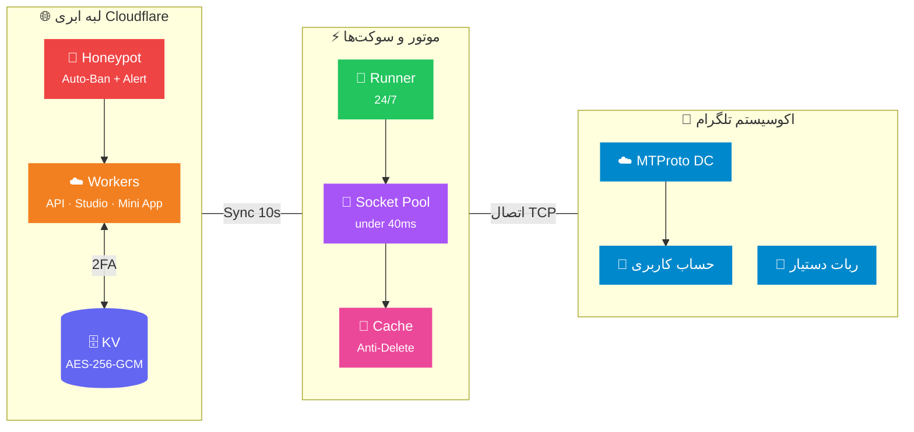

<div align="center">

[🇮🇷 فارسی](README.md) &nbsp; | &nbsp; [🇬🇧 English](README.en.md)



<br>

<h3>🔮 پلتفرم نسل جدید سلف‌بات هوشمند، حالت روح، امنیت ۲FA و استودیوی تلگرام</h3>
<h4><i>Next-Gen Telegram Profile Engine, 2FA Security, Ghost Mode, AI Smart Reply & Edge Logger Studio with Sub-40ms MTProto Precision</i></h4>

<br>

<a href="https://github.com/ArizoOwner/arizo-telegram-self-manager/actions"></a>
<a href="#"></a>
<a href="#"></a>
<a href="#"></a>
<a href="#"></a>

<br><br>

<a href="https://arizo-self.arizosupport.workers.dev/setup"></a>
<a href="https://arizo-self.arizosupport.workers.dev/"></a>

<br><br>

> [!TIP]
> **🚀 ویزارد راه‌اندازی سریع و هوشمند تحت وب (Online Setup Wizard):**  
> برای راه‌اندازی و کانفیگ آسان بدون نیاز به دستورات پیچیده، مستقیماً وارد **[ویزارد راه‌اندازی ابری Arizo Self](https://arizo-self.arizosupport.workers.dev/setup)** شوید:  
> **🔗 لینک مستقیم: [https://arizo-self.arizosupport.workers.dev/setup](https://arizo-self.arizosupport.workers.dev/setup)** (همچنین در دسترس روی مسیر `/wizard`)

<br>

<p align="center">
  
</p>

<p align="center"></p>

<p align="center"></p>

<br>

<a href="https://workers.cloudflare.com/"></a>


<br><br>

</div>

<p align="center"></p>

<div align="center">

### 「 ✦ ۱۸ قابلیت برتر سامانه (Core Capabilities) ✦ 」

</div>

<table>
<tr>
<td width="50%">

### ⏱️ &nbsp; ۱. ساعت زنده و اتمی (Atomic Clock)
> آپدیت خودکار دقیقه به دقیقه زمان تهران در نام حساب با دقت زیر ۱۰۰ms و سوکت‌های گرم در حافظه

- 🎯 زمان‌بندی دقیق رأس دقیقه `00.000` بدون عقب‌افتادگی
- 🎨 بیش از **۳۲ فونت فانتزی** (نئون، دایره‌ای، رومی، قلمی و ریاضی)
- 🕐 پشتیبانی کامل از فرمت‌های ۱۲ و ۲۴ ساعته با پیشوند/پسوند دلخواه
- ⚡ هماهنگ‌سازی بلادرنگ بدون قطعی یا لیمیت اکانت

</td>
<td width="50%">

### 📝 &nbsp; ۲. بیوگرافی پویا و تقویم (Dynamic Bio)
> نمایش زنده تقویم هجری شمسی، روز هفته و ساعت در بخش Bio تلگرام

- 📅 متغیرهای هوشمند `{time}`، `{date}` و `{day}` با تقویم جلالی
- 📐 متناسب‌سازی خودکار با محدودیت ۷۰ کاراکتر بیو تلگرام
- 🔄 به‌روزرسانی ابری خودکار همگام با ساعت
- 🎭 قالب‌های از پیش‌آماده و امکان تعریف متن دلخواه

</td>
</tr>
<tr>
<td width="50%">

### 💬 &nbsp; ۳. منشی و پاسخگوی AFK (Auto-Secretary)
> پاسخگویی هوشمند ۲۴ ساعته در زمان عدم حضور شما در پیوی

- 💬 امکان شخصی‌سازی کامل متن پاسخ منشی
- ⏰ زمان‌بندی وقفه ضد اسپم (Cooldown) از ۱ دقیقه تا ۲۴ ساعت
- 🚫 فیلتر هوشمند اکانت‌های رسمی تلگرام و ربات‌ها
- 📋 امکان تعیین لیست استثنا و نادیده گرفتن چت‌های خاص

</td>
<td width="50%">

### 🤖 &nbsp; ۴. دستیار هوش مصنوعی (AI Smart Reply)
> تعامل زبانی و پاسخ‌دهی خودکار به چت‌ها با هوش مصنوعی یکپارچه

- 🧠 تحلیل محتوای پیام‌های ورودی و تولید پاسخ متناسب
- 🎯 قابلیت فعال/غیرفعال‌سازی سریع برای چت‌های خاص
- 🛡️ اعمال محدودیت هوشمند برای پیشگیری از حلقه‌های گفتگوی رباتی
- ⚡ واکنش بلادرنگ و بدون نیاز به نگهداری سرور مجزا

</td>
</tr>
<tr>
<td width="50%">

### 🗑️ &nbsp; ۵. پایشگر ضد حذف (Anti-Delete Monitor)
> شکار، ذخیره و ارسال آنی پیام‌های پاک‌شده توسط مخاطبان در پیوی به ربات دستیار

- 🔍 کش فوق‌سبک در حافظه رانر بدون افت سرعت
- 👤 استخراج نام، یوزرنیم، آیدی عددی و زمان دقیق ارسال پیام
- 📝 بازیابی کامل متن، استیکر، ویس، عکس و فایل
- 🛡️ نادیده گرفتن خودکار پیام‌های حذف‌شده ناشی از فیلتر سکوت

</td>
<td width="50%">

### ✏️ &nbsp; ۶. پایشگر ضد ویرایش (Anti-Edit Monitor)
> رهگیری آنی پیام‌های تغییریافته در پیوی و ثبت متن قبل و بعد ادیت

- ⚡ استخراج مستقیم تغییرات از آپدیت‌های خام MTProto تلگرام
- 🕒 ثبت دقیق لحظه و تاریخ ویرایش متن فرستنده
- ⏮️ تفکیک بصری متن اولیه و متن جدید همراه با نقل‌قول شکیل
- 🔔 ارسال آنی گزارش به ربات اختصاصی شما در تلگرام

</td>
</tr>
<tr>
<td width="50%">

### 🔥 &nbsp; ۷. آرشیو رسانه‌های محوشونده (Anti-TTL Saver)
> دانلود و ذخیره عکس‌ها و ویدیوهای یک‌بار مصرف (View-Once) قبل از سوختن

- 🛡️ تشخیص انواع تایمرهای ثانیه‌ای و محوشونده
- 🖼️ استخراج بی‌نقص عکس، فیلم، ویس و ویدیو مسیج دایره‌ای
- 🚀 تحویل تضمینی به ربات شخصی تلگرام با کیفیت اورجینال
- 💾 سیستم پشتیبان ذخیره در Saved Messages در صورت مسدود بودن ربات

</td>
<td width="50%">

### 👻 &nbsp; ۸. حالت روح و نامرئی (Ghost Mode)
> باز کردن و خواندن پیام‌های چت بدون ارسال تیک خوانده‌شدن (سین)

- 👁️ غیرفعال‌سازی ارسال Read Receipts در پیام‌های دریافتی
- ⌨️ دستورات سریع تلگرامی `.ghost on` و `.ghost off`
- 📖 دستور تلگرامی `.read` برای خواندن بدون تیک چت جاری
- 📚 دستور `.read all` برای خواندن بی سر و صدای تمام چت‌ها

</td>
</tr>
<tr>
<td width="50%">

### 🔇 &nbsp; ۹. فیلتر سکوت و حذف دوطرفه (Mute Filter)
> سایلنت کردن و حذف قطعی و دوطرفه پیام‌های کاربران مزاحم

- 🗑️ حذف دوطرفه بلادرنگ با پرچم `revoke: true`
- 🔢 پشتیبانی از ارقام فارسی و انگلیسی به صورت خودکار
- ⌨️ دستورات سریع تلگرامی `.mute` و `.unmute` در متن پیام
- 👻 بازیابی خودکار AccessHash برای اشخاص خارج از مخاطبین

</td>
<td width="50%">

### 🌙 &nbsp; ۱۰. حالت خواب و استراحت (Sleep Mode)
> تنظیم خودکار وضعیت به استراحت و خواب در ساعات شبانه

- 😴 تغییر خودکار نام خانوادگی به متن استراحت (مانند 😴 Sleep)
- ⏰ تعیین بازه زمانی دقیق خواب شبانه و بازگشت خودکار در صبح
- ⚡ توقف هوشمند منشی و وظایف سنگین در ساعات استراحت
- 🔋 بهینه‌سازی حداکثری مصرف منابع و سهمیه‌های شبکه

</td>
</tr>
<tr>
<td width="50%">

### 🔐 &nbsp; ۱۱. تایید دومرحله‌ای گوگل (Google 2FA TOTP)
> بالاترین استاندارد امنیتی برای ورود به پنل با Google Authenticator

- 🔑 سازگار با استاندارد RFC 6238 با کدهای ۶ رقمی ۳۰ ثانیه‌ای
- 📱 ایجاد آنی بارکد QR و کلید دستی ۳۲ کاراکتری
- 🆘 تولید ۸ کد بازیابی اضطراری (Emergency Backup Codes) یک‌بار مصرف
- 🛡️ ماندگاری و انقضای هوشمند سشن در سراسر داشبورد

</td>
<td width="50%">

### 🍯 &nbsp; ۱۲. دفاع فعال هانی‌پات (Zero-Trust Honeypot)
> تله امنیتی و مهار خودکار اسکنرهای مخرب در لبه شبکه Cloudflare

- 🚨 مسیرهای تله برای ردیابی پویشگران آسیب‌پذیری وب و دات‌ان‌وی
- 🚫 بلاک دائم و آنی IPهای متخاصم
- 📲 ارسال فوری هشدار امنیتی به ربات تلگرام مالک
- 🛡️ معماری Zero-Trust بدون سربار روی درخواست‌های مجاز

</td>
</tr>
<tr>
<td width="50%">

### 💾 &nbsp; ۱۳. پشتیبان‌گیری رمزنگاری‌شده (Encrypted Backup)
> خروجی کامل و بازیابی تمام داده‌ها با رمزنگاری نظامی AES-GCM

- 📦 ذخیره کلیه تنظیمات، سشن تلگرام، لیست‌ها و الگوها در یک فایل
- 🔒 قفل محتوا با الگوریتم AES-256-GCM و پسورد دلخواه کاربر
- 🔄 بازیابی آنی و بی‌نقص بدون نیاز به پیکربندی مجدد
- 🌐 ایمن در برابر نشت اطلاعات حتی در صورت دسترسی غیرمجاز

</td>
<td width="50%">

### 🎨 &nbsp; ۱۴. کتابخانه ۳۲ قلم نوشتاری ساعت (32 Clock Fonts)
> مجموعه کامل قلم‌های ساعت دیجیتال با پیش‌نمایش گرافیکی زنده

- 💎 انواع فونت‌های نئون، دایره‌ای، رومی، قلمی و ریاضی
- 🔢 پشتیبانی از ارقام اصیل فارسی (`۱۲:۳۴`) و لاتین (`12:34`)
- 👁️ پیش‌نمایش گرافیکی بلادرنگ روی ماک‌آپ واقعی تلگرام در پنل
- ⚙️ تغییر آنی قلم بدون نیاز به ریستارت یا لاگین مجدد

</td>
</tr>
<tr>
<td width="50%">

### 📱 &nbsp; ۱۵. مینی‌اپلیکیشن تلگرام (Telegram Mini App)
> کنترل کامل سلف‌بات مستقیماً از داخل تلگرام بدون نیاز به مرورگر

- ⚡ اتصال بومی به ربات شخصی تلگرام با دکمه شیشه‌ای Web App
- 🌓 هماهنگی خودکار با تم لایت/دارک تلگرام شما
- 📊 گزارش زنده عملکرد، سوکت‌ها و لاگ‌های اخیر
- 🛠️ تغییر آنی پیکربندی‌ها با رابط لمسی مدرن

</td>
<td width="50%">

### ⚡ &nbsp; ۱۶. زیرساخت ابری سرورلس (Serverless Edge 24/7)
> پایداری دائمی روی شبکه جهانی Cloudflare Workers بدون نیاز به سرور

- 🌍 میزبانی در صدها دیتاسنتر لبه کلودفلر با تاخیر زیر ۱۰۰ms
- 📴 کارکرد ۲۴ ساعته مستقل از روشن بودن گوشی یا مصرف اینترنت
- 🗄️ تفکیک کامل داده‌های هر کاربر با پارتیشن‌های ایزوله KV
- 💰 کاملاً رایگان و بهینه بدون نیاز به پرداخت هزینه سرور ماهانه

</td>
</tr>
<tr>
<td width="50%">

### 👑 &nbsp; ۱۷. مرکز مدیریت ارشد یکپارچه (Direct Admin Portal)
> دسترسی بی‌واسطه و امن برای مدیران سیستم با یکپارچگی کامل نشست کاربری

- 🚀 ورود مستقیم به پنل مدیریت بدون نیاز به رمز مستر یا لاگین چندباره
- 🛡️ پنهان‌سازی ۱۰۰٪ امن دکمه پنل مدیریت از دید کاربران عادی و مهمانان
- 📊 گزارش زنده شاخص‌های کلی (کاربران، ربات‌ها، کدهای انبار و مصرفی)
- 🎟️ سیستم صدور، ابطال و مدیریت لایسنس‌های پیشرفته

</td>
<td width="50%">

### 🔍 &nbsp; ۱۸. بازرسی و مانیتورینگ متمرکز کاربران (User Inspector)
> مدیریت جامع و متمرکز حساب کاربران از طریق پنجره بازرس پیشرفته

- 🔎 ستون عملیات خلوت با تک دکمه مدرن «🔍 مانیتورینگ»
- 🎛️ پنجره چندستونه عملیات سریع (تغییر پلن، قطع تلگرام، ریست رمز، تعلیق و تغییر نقش)
- 📡 نظارت بر وضعیت زنده موتور سلف، تله‌متری و رکوردهای امنیتی
- 🚨 اعمال آنی محدودیت‌ها بدون تداخل با نشست‌های فعال

</td>
</tr>
</table>

<p align="center"></p>

<div align="center">

### 「 ✦ جدول دستورات درون‌برنامه‌ای تلگرام (Telegram Commands Cheatsheet) ✦ 」

</div>

<p align="center"></p>

> این دستورات مستقیماً در گفتگوهای تلگرام و بدون نیاز به ورود به پنل وب قابل استفاده هستند:

| دستور | نوع کاربرد | توضیحات عملکرد |
|:---|:---|:---|
| `.ghost on` | در هر گفتگوی شخصی | فعال‌سازی حالت روح (عدم ارسال تیک دوم و سین خوانده‌شدن) |
| `.ghost off` | در هر گفتگوی شخصی | غیرفعال‌سازی حالت روح و بازگشت به حالت عادی |
| `.read` | در هر چت یا گروه | خواندن آرام چت جاری بدون ثبت اعلان مزاحم |
| `.read all` | در هر گفتگوی شخصی | سین زدن خاموش و بی‌صدا برای تمامی پیام‌های خوانده‌نشده حساب |
| `.mute` | ریپلای روی پیام شخص | ساکت‌سازی کاربر و حذف دوطرفه تمام پیام‌های آتی او |
| `.mute @username` | ارسال در چت | افزودن مستقیم یوزرنیم به لیست سکوت و پاکسازی دوطرفه |
| `.unmute` | ریپلای یا با یوزرنیم | لغو وضعیت سکوت و بازگرداندن کاربر به حالت عادی |
| `/start` | در ربات دستیار شخصی | باز کردن منوی شیشه‌ای و دسترسی به مینی‌اپلیکیشن پنل |
| `/test` | در ربات دستیار شخصی | ارسال پیام آزمایشی جهت اعتبارسنجی ارسال گزارش و رسانه |
| `/status` | در ربات دستیار شخصی | استعلام زنده وضعیت اتصال سلف‌بات، حافظه و سلامت سیستم |

<p align="center"></p>

<div align="center">

### 「 ✦ معماری سامانه (System Architecture) ✦ 」

</div>

<p align="center"></p>



<p align="center"></p>

<div align="center">

### 「 ✦ استودیوی وب و طراحی لوکس شیشه‌ای (Web Studio) ✦ 」

</div>

<table>
<tr>
<td align="center">💎<br><b>طراحی شیشه‌ای نئو</b><br><sub>Glassmorphism & Depth</sub></td>
<td align="center">📱<br><b>ریسپانسیو ۱۰۰٪</b><br><sub>موبایل، تبلت و دسکتاپ</sub></td>
<td align="center">🌓<br><b>تم دوگانه روز و شب</b><br><sub>Dark / Light Aurora Modes</sub></td>
<td align="center">⚡<br><b>فیزیک فنری و انیمیشن</b><br><sub>Spring Physics & Haptics</sub></td>
<td align="center">🚀<br><b>ذخیره و هماهنگ‌سازی آنی</b><br><sub>Instant Profile Sync</sub></td>
</tr>
</table>

<p align="center"></p>

<div align="center">

### 「 ✦ امنیت، حریم خصوصی و استانداردهای نظامی ✦ 」

</div>

<p align="center"></p>

<table>
<tr>
<td width="25%" align="center">
<h3>🔐</h3>
<b>Google 2FA (RFC 6238)</b><br>
<sub>کد یکبارمصرف ۳۰ ثانیه‌ای، بارکد QR و کدهای اضطراری</sub>
</td>
<td width="25%" align="center">
<h3>🍯</h3>
<b>Zero-Trust Honeypot</b><br>
<sub>مهار اسکنرها، بلاک دائمی IP و ارسال هشدار امنیتی به ربات</sub>
</td>
<td width="25%" align="center">
<h3>🛡️</h3>
<b>AES-256-GCM</b><br>
<sub>رمزنگاری سطح نظامی داده‌ها و سشن‌های کاربری در KV</sub>
</td>
<td width="25%" align="center">
<h3>🔒</h3>
<b>Exclusive Owner Lock</b><br>
<sub>قفل انحصاری ربات به مالک و ایزولاسیون کامل چندکاربره</sub>
</td>
</tr>
</table>

<p align="center"></p>

<div align="center">

### 「 ✦ راهنمای راه‌اندازی سریع (Quick Start) ✦ 」

</div>

> [!TIP]
> ### 🧙‍♂️ ویزارد گرافیکی و هوشمند راه‌اندازی (Interactive Web Setup Wizard)
> **سریع‌ترین و بی‌دردسرترین روش برای راه‌اندازی و کانفیگ کامل Arizo Self:**  
> 🔗 **لینک ورود مستقیم:** **[https://arizo-self.arizosupport.workers.dev/setup](https://arizo-self.arizosupport.workers.dev/setup)**  
> 
> ویزارد هوشمند ۵ مرحله‌ای شامل امکانات زیر است:
> - 📄 **تولیدکننده خودکار `wrangler.toml`** با مقادیر و بایندینگ‌های معتبر شما
> - 🤖 **تستر و ولیدیتور آنلاین توکن ربات تلگرام** با اعتبارسنجی بلادرنگ
> - 🗄️ **پایش وضعیت پایگاه‌داده D1 و حافظه KV** در لبه Cloudflare
> - ✅ **چک‌لیست آمادگی نهایی** جهت شروع بدون نقص استقرار

#### ☁️ &nbsp; روش ۱: استقرار رایگان روی Cloudflare Workers + GitHub Actions (توصیه‌شده)

1. مخزن را فورک یا کلون نمایید:
   ```bash
   git clone https://github.com/ArizoOwner/arizo-telegram-self-manager.git
   cd arizo-telegram-self-manager
   ```

2. ورکر را در کلودفلر مستقر کنید:
   ```bash
   npx wrangler deploy
   ```

3. متغیرهای زیر را در بخش **Settings → Secrets and variables → Actions** در ریپازیتوری گیت‌هاب تعریف کنید:
   - `CLOUDFLARE_URL`: آدرس ورکر استقرار یافته (مانند `https://your-worker.workers.dev`)
   - `RUNNER_SECRET`: کلید احراز هویت مشترک میان رانر و پنل
   - `GITHUB_TOKEN`: توکن با مجوز `workflow` جهت تداوم ۲۴ ساعته رانر

4. از تب **Actions** گیت‌هاب، چرخه `⚡ Telegram Clock Engine` را فعال و اجرا کنید.

#### 🤖 &nbsp; فعال‌سازی ربات و لاگر اختصاصی تلگرام

1. به ربات رسمی **[@BotFather](https://t.me/BotFather)** در تلگرام رفته و با دستور `/newbot` یک ربات جدید ایجاد کنید.
2. توکن ربات دریافتی را کپی کنید.
3. در استودیوی Arizo وارد بخش **«⚡ ربات و لاگر»** شوید، توکن را ثبت و وب‌هوک را فعال کنید.
4. وارد ربات خود شده و دستور `/start` را ارسال فرمایید تا پیوند مینی‌اپ و گزارش‌گیری فعال شود.

#### 💻 &nbsp; روش ۲: اجرای مداوم روی سرور اختصاصی (VPS) با PM2

```bash
# ۱. نصب پیش‌نیازها
npm install --production

# ۲. تنظیم متغیرها
export CLOUDFLARE_URL="https://your-worker.workers.dev"
export RUNNER_SECRET="your_secure_password"

# ۳. اجرای دائمی با پروسس منیجر PM2
pm2 start scripts/github-runner.js --name arizo-self-engine
pm2 save && pm2 startup
```

<p align="center"></p>

<div align="center">

### 「 ✦ تکنولوژی‌های استفاده‌شده (Tech Stack) ✦ 」

<br>


<br><br>

| لایه | تکنولوژی | نقش و کاربرد در سامانه |
|:---:|:---|:---|
| 🌐 | **Cloudflare Workers** | پردازش لبه، مینی‌اپلیکیشن تلگرام، وب‌هوک و امنیت هانی‌پات |
| 🗄️ | **Workers KV Storage** | پایگاه داده ابری رمزنگاری‌شده با تفکیک ایزوله برای هر کاربر |
| ⚡ | **GitHub Actions / VPS** | موتور رانر ۲۴ ساعته سوکت‌های گرم با تاخیر زیر ۴۰ میلی‌ثانیه |
| 📡 | **GramJS (MTProto 2.0)** | کلاینت رسمی پروتکل تلگرام برای تبادل داده و آپدیت‌های زنده |
| 🔐 | **Google Authenticator (TOTP)** | تایید هویت دومرحله‌ای سازگار با استاندارد جهانی RFC 6238 |
| 🤖 | **Telegram Bot API** | دریافت گزارش‌های ضد حذف، ضد ویرایش و مدیریت تلگرامی |
| 🎨 | **Vanilla CSS + Glassmorphism** | رابط کاربری لوکس شیشه‌ای با واکنش‌گرایی کامل موبایل و وب |

<br>

<p align="center"></p>

<br>


<br>

<samp>

**Arizo Self Engine v3.6 PRO** — مهندسی شده برای بالاترین سرعت، امنیت نفوذناپذیر و تجربه کاربری بی‌همتا 💎

*Engineered with precision for maximum speed, bulletproof 2FA security & pure aesthetics*

Made with ❤️ by **Arizo Team**

</samp>

</div>
